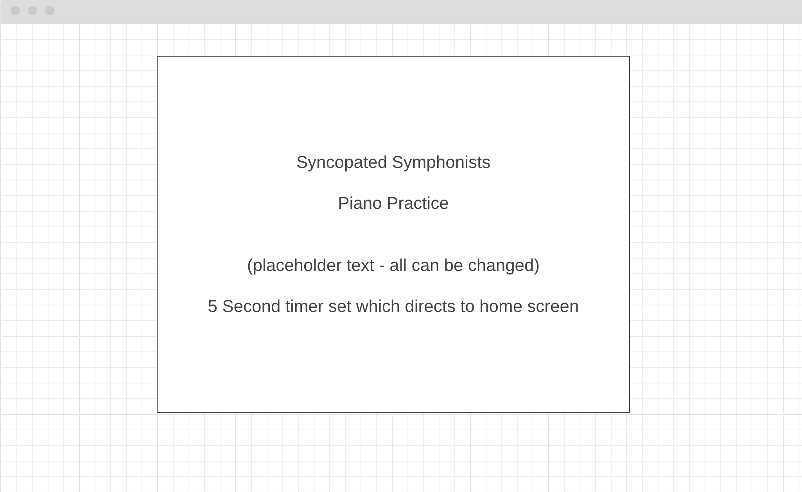
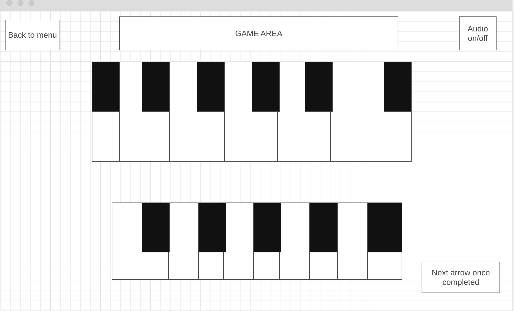
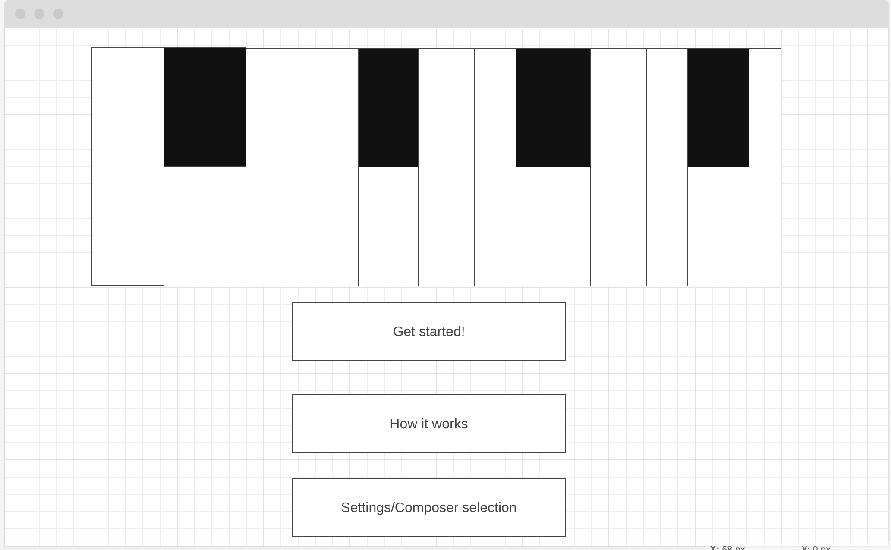
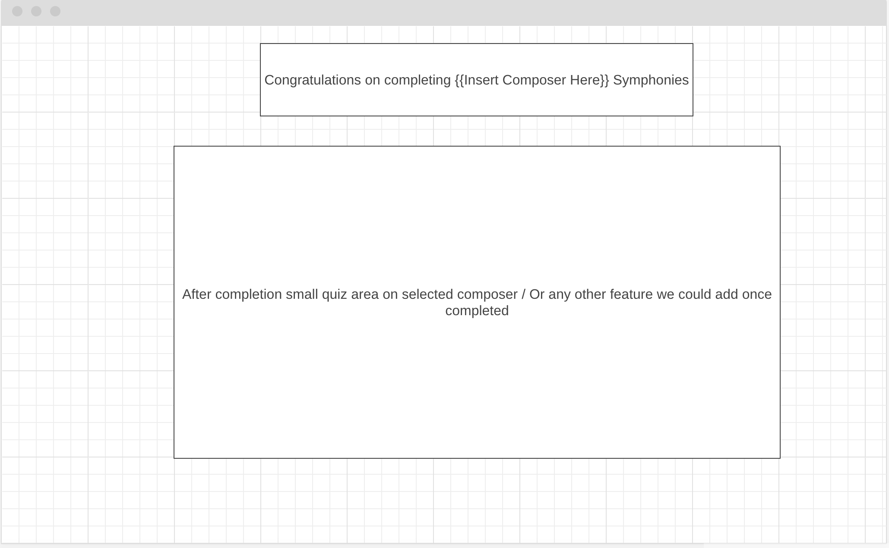
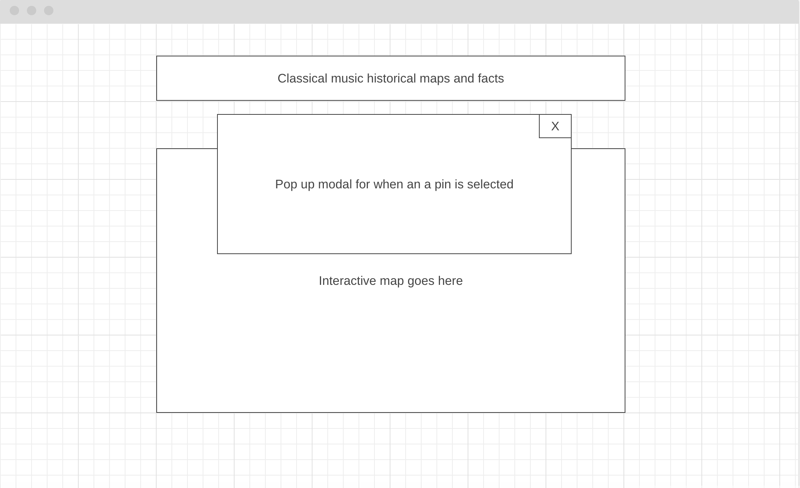
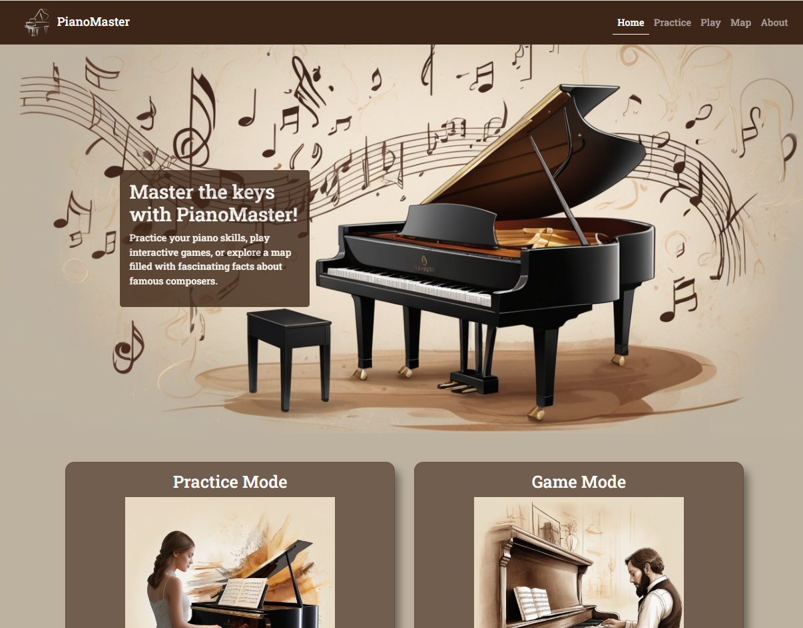
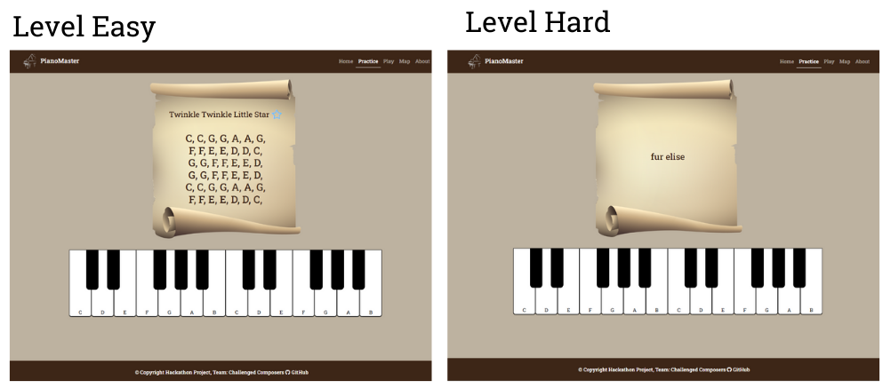
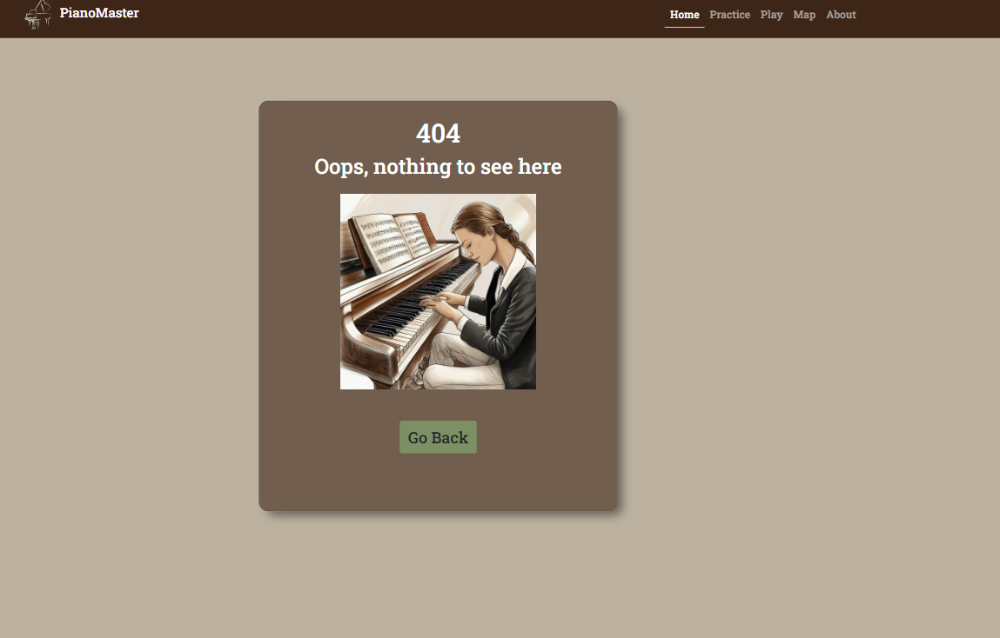

#  Piano Master

[View the Live Project Here](https://mickjitsu.github.io/team_6_hackathon/)  
*(To open in a new window, press "ctrl" (or ⌘ for Mac) + click on the link)*

Welcome to the Piano Master, a fully functioning musical game to improve your piano skills. This project is a collaborative effort by a team of 7 developers, the Challenged Composers, within the scope of Code Institute's Hackathon.

#  Table Of Content

- [User Experience](#logo-dark-xs-user-experience)
  - [Site Goals](#site-goals)
  - [Scope](#scope)
- [Design](#logo-dark-xs-design)
  - [Colour Scheme](#colour-scheme)
  - [Fonts](#fonts)
  - [Wireframes](#wireframes)
- [Agile Methodology](#logo-dark-xs-agile-methodology)
    - [EPICS(Milestones)](#epics-milestones)
    - [User Stories issues](#user-stories-issues)
- [Features](#logo-dark-xs-features)
  - [Navbar](#navbar)
  - [Footer](#footer)
  - [Home](#home)
  - [Error Pages](#error-pages)
  - [Future Features](#future-features)
- [Testing](#logo-dark-xs-testing)
  - [Manual Testing](#manual-testing)
  - [Automated Testing](#automated-testing)
- [Bugs](#logo-dark-xs-bugs)
- [Technologies And Languages](#logo-dark-xs-technologies-and-languages)
  - [Languages Used](#languages-used)
  - [Technologies and programs](#technologies-and-programs)
- [Deployment](#logo-dark-xs-deployment)
  - [Deployment](#deployment)
  - [Creating A Fork](#creating-a-fork)
  - [Cloning Repository](#cloning-repository)
- [Credits](#logo-dark-xs-credits)
  - [Media](#media)
  - [Code](#code)
  - [Contributors](#contributors)
  - [Acknowledgements](#acknowledgements)
  - [Comments](#comments)

##  User Experience

##### Target Audience

- Anyone who enjoys classical music.
- People who enjoy playing online games. 
- Those who don't have or do not wish to have a counterpart to play with.

##### First Time Visitors Goals

As a firs time user, 
- I can play a musical game so I can enjoy learning new things without straining myself.
- I can easily understand and follow the simple rules of the game.
- I get instant positive feedback while playing the game.
- I don't have to organize an opponent player to play the game so I can enjoy playing the game by myself.

##### Returning Visitors Goals

As a returning visitor, 
- I enjoy getting more positive feedback as I practice more to play the game.
- I still find the game exciting because I am constantly improving my skills.

##### Frequent Visitors Goals

As a frequent visitor, 
- I can play a visually appealing game to pass time in a fun way and/or to clear my head between long working sessions.

##### Site Goals

- To provide a fun and engaging musical game experience.

##### Scope

- The main piano game is be optimized for desktop devices, but still playable on mobile, tablet devices as well. 
- All other pages and features are fully responsive on all screensizes and optimized for mobile, tablet, and desktop devices.

##  Design

##### Colour Scheme

The color scheme was detected from the hero image and chosen to create a warm and harmonious atmosphere.

A limited color palette is used to avoid visual clutter.

[Coolors.co](https://coolors.co/contrast-checker/ffffff-3d2617) was used to validate color contrast for web accessibility in terms of readability.

##### Fonts

[Rototo slab](https://fonts.google.com/specimen/Roboto+Slab?query=roboto+slab) was chosen as the primary font for a classy look with a focus on readability. The font is variable and offers a range of weights, making it suitable for various design elements.

##### Wireframes

The wireframes were created using [Canva](https://www.canva.com/).

##  Agile Methodology

This project utilizes Agile Development Methods to manage development and ensure efficient delivery.

##### EPICS (Milestones)

The epics represent the high-level objectives and functionalities of the project. These can be further divided into granular tasks, as defined in the user stories. 

##### User Stories Issues

Detailed descriptions that outline the project's functionalities from the user's perspective. 

For details to the Epics and User Stories, please visit the project's [Kanban Board](https://github.com/users/Mickjitsu/projects/3).

##### The MoSCoW Prioritization Method

The acronym stands for Must Have, Should Have, Could Have, and Won't Have. To effectively manage resources and development flow, based on urgency and necessity, the prioritization method MoSCoW was employed. 

A structural approach to determine which features are essential for the current stage (Must Have), which can be incorporated if time allows (Should Have), which might be deferred for later iterations (Could Have), and which are excluded from this iteration or unlikely to be implemented (Won't Have). 
The priorities are reflected with **labels** on each user story on [this project's Kanban board](https://github.com/users/Mickjitsu/projects/3)

##  Features

##### Navbar

The website uses a clean layout with a clear visual hierarchy for easy navigation.
The user's current location on the website is always indicated in the navigation bar.
Navigation elements (links and buttons) are prominently placed and clearly labeled.

##### Footer

The footer is minimalistic and contains only copyright related information about the project.

##### Home

The Home page is a visually appealing introduction to the website, with a hero image and a brief description of what the website has to offer.

##### Practice Mode

The Practice Mode allows users to play a musical game with a piano keyboard. The game provides a fun and engaging way to learn and practice musical skills without any validation of the user's performance.

The user can choose between two difficulty levels: Easy and Hard.

##### Game Mode

The Game Mode allows users to play a musical game with a piano keyboard. The game provides a fun and engaging way to learn and practice musical skills with validation of the user's performance. The user gets a score based on their performance.

##### User Feedback

The user receives feedback on their performance, encouraging them to play on.

##### Music Map

The user can choose from a list of famous composers and when clicked, the interactive map shows their birthplace and fun facts about the composer.

##### About Us

The About Us page provides information about the team behind the project.

The user can turn the record to view personal information about the team members and how to connect to them on GitHub or LinkedIn.

##### Error Pages

The project uses a custom HTML error page for status code 404 (Not Found) for improved user experience. The error page maintains a consistent design with the rest of the website, clearly explains the meaning of the error code in a user-friendly way avoiding technical jargon, and uses clear, concise language. The error page displays a friendly image in line with the website theme to make the error page more visually appealing.

##### Future Features

The game is coded in a way that it can be quickly extended to include more features and functionalities. The logic for playing the instrument compared to the song notes can be used for further songs and keyboard instruments.

Dark Mode would be a nice addition to the game but this was beyond the scope of this project.

##  Testing

##### Manual Testing

| Epic | Title | User Story | Expected Result | Result |
|---|---|---|---|---|
| Website Structure | Website Basic Structure | As a user I can view a welcoming homepage so I can easily identify the website's purpose. | Welcoming, clear structured website | Passed |
| Website Structure | Responsive Layout | As a user I can play the game on different devices so that I have options. | Responsive on all screen sizes | Passed |
| Website Structure | Navigation and Orientation | As a user I can intuitively use the site navigation so that I easily orientate myself. | Easy to navigate and orientate | Passed |
| Website Structure | About Us | As a user I can access an 'About Us' page to learn more about the creators so that I can gain trust in the application. | Team Introduction | Passed |
| Website Structure | Interactive Pop-Ups | As a user I can click on interactive features so that can get additional information on the subject. | Clickable elements open in Pop-Up with fun facts | Passed |
| Music Lounge | Instrument Piano | As a user, I want to be able to play digital piano, so that I can play the game. | Digital piano with audio and visual feedback | Passed |
| Game | Game Logic | As a user, I want to play a game so that I can have fun. | The game logic is intuitive | Passed |
| Game | Game Logic – Rules (Text) | As a user, I want to read the rules so I know how to play the game. | The rules are easily understood and accessible throughout the game | Passed |
| Game | Difficulty Levels – Choices | As a user, I want to be able to choose between different difficulty levels for the game. | Menu for choice of level displayed | Passed |
| Game | Difficulty Levels – Game Effect | As a user, I want the difficulty level to affect the speed of the falling notes and the complexity of the rhythm. | Game behaves according to user choice level | Passed |
| Game | Scoring | As a user, I can keep a score while playing so that I can feel rewarded for a well-played game. | A score table is updated with each score | Passed |
| User Experience | Username | As a user, I can enter my username so that my user experience is more personal and fun. | The username is displayed | Passed |
| User Experience | User Feedback | As a user, I get visual feedback to actions so that I am always informed of the game state. | User feedback for all actions | Passed |
| User Experience | Web Accessibility | As a user with disabilities or using assistive technologies, I can easily navigate the website so that I can enjoy the website. | Operable: keyboard interface compatible, Distinguishable, e.g., the use of color | Passed |
| User Experience | Design | As a user I can view a pleasant website design so that can enjoy using it. | The overall design is clean and the color palette is limited to avoid visual clutter | Passed |

##### Automated Testing

All validator testing was performed on the deployed website.

##### HTML Validator Testing

The HTML code passed through the [World Wide Web Consortium's validator](https://validator.w3.org/) with no errors.

Click for Image HTML Validator Testing

##### CSS Validator Testing

No errors were detected when passing through the official [World Wide Web Consortium (W3C) validator](https://validator.w3.org/) for CSS.

Click for Image CSS Validator Testing

##### JavaScript Validator Testing

The JavaScript passed without errors through the [JSHint Validator](https://jshint.com/), a JavaScript Code Quality Tool.

Click for Image JavaScript Validator Testing

##  Bugs

### Known Bugs

There are no known bugs in the deployed project.

### Resolved Bugs

| Bug             | Description                                                                                       | Solution Applied                                                                                                                                | Result |
|-----------------|---------------------------------------------------------------------------------------------------|-------------------------------------------------------------------------------------------------------------------------------------------------|--------|
| Merge conflicts | Forking the repository and cloning it to the local machine caused time consuming merge conflicts. | Create a branch for each feature and to merge it into the main branch. Allows a complete overview and access to each team members current task. | Solved |

##  Technologies And Languages

##### Languages Used

- HTML
- CSS
- JavaScript
- Markdown for this README.md

##### Technologies and Programs

- [Canva](https://www.canva.com/) to create images
- [Photoroom](https://www.photoroom.com/tools/background-remover) to remove background from images
- [Pixelied](https://pixelied.com/convert) to convert images to webp format
- [TinyPNG](https://tinypng.com/) to compress images
- [Leonardo AI](https://leonardoai.com/) to create images
- [Coolors.co](https://coolors.co/contrast-checker/ffffff-3d2617) for color contrast checker
- [Techsini.com](https://techsini.com/multi-mockup/index.php) to create the mockup for this README
- [World Wide Web Consortium's HTML validator](https://validator.w3.org/) to validate HTML
- [World Wide Web Consortium's CSS validator](https://validator.w3.org/) to validate CSS
- [JSHint Validator](https://jshint.com/) to validate JavaScript

##  Deployment

##### Deployment

To deploy the repository using GitHub Pages:
- Navigate to settings of the repository on the top navigation menu.
- Navigate to Pages on the left sidebar navigation menu.
- In the section "Build and deployment”, go to Source and select "Deploy from a branch" from the navigation dropdown menu.
- In the section "Branch", select the following from the dropdown menus: "Main", "Root" and click "Save".
- The link to the deployed website will appear at the top of the section as soon as processed.
- The link is accessible from the main page of the depository on the right navigation menu under "Deployments".

##### Creating A Fork

To fork the repository:
- Log in to Github and navigate to the repository of this project.
- Click the button "Fork" in the top right corner to open dropdown menu and select "Create a new fork".

##### Cloning Repository

To clone the repository:
- Log in to GitHub and navigate to the repository of this project.
- Click on the green button "Code" to open the dropdown menu, select "Clone with HTTPS, SSH or GitHub CLI" and copy the link provided.
- Open "Terminal" (or "Git Bash") in your code editor.
- Change the current working directory to the location where you want the cloned directory to be made.
- Type "git clone" in the terminal and then paste the URL copied on GitHub in step 2, above.
- Press "Enter" and your local clone will be created.

##  Credits

##### Media

- [Leonardo AI](https://leonardoai.com/) to generate images
- [Papyrus](https://www.creativefabrica.com/product/old-scroll-paper-banner/) as background for the musical notes
- [Piano](https://www.pngwing.com/en/free-png-pvmnq) for the website logo
- [Flaticon](https://images.app.goo.gl/PWfvDzdiRbpJBigi9) for the favicon
- [Vinyl Record, Image by Wikimedial mages, Pixabay](https://pixabay.com/photos/vinyl-lp-record-angle-2202325/) for the about us page

##### Code

[W3Schools](https://www.w3schools.com/howto/howto_css_flip_card.asp) for flip card on team page

##### Contributors

- Dayana Nashkova - [GitHub](https://github.com/Dayana-N), [LinkedIn](https://www.linkedin.com/in/dayana-nashkova-b46463165/)
- Damir Ćorić - [GitHub](https://github.com/CorDamir), [LinkedIn](https://www.linkedin.com/in/damir-ćorić-03a166310/)
- Erin Doyle - [GitHub](https://github.com/erinvdoyle), [LinkedIn](https://www.linkedin.com/in/erinvdoyle)
- Gudrun Omarsdottir - [GitHub](https://github.com/g-omarsdottir), [LinkedIn](http://www.linkedin.com/in/gudrun-omarsdottir)
- Henna Singh - [GitHub](https://github.com/hennasingh), [LinkedIn](http://www.linkedin.com/in/hennasingh), [Website](https://hennasingh.dev/)
- Michael M. - [GitHub](https://github.com/MickJitsu), [LinkedIn](http://www.linkedin.com/in/michael-m-8818b5194)
- Vasilis Tsimourdagkas - [GitHub](https://github.com/Vasileios20), [LinkedIn](https://www.linkedin.com/in/vasileios-tsimourdagkas/)

##### Acknowledgements

- [Code Institute](https://codeinstitute.net/) for this Hackathon event
